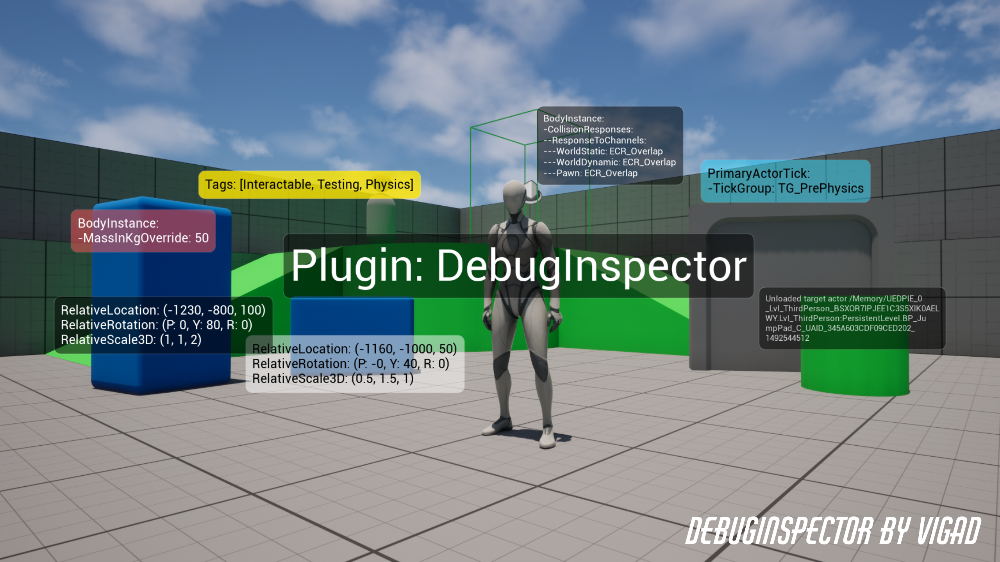
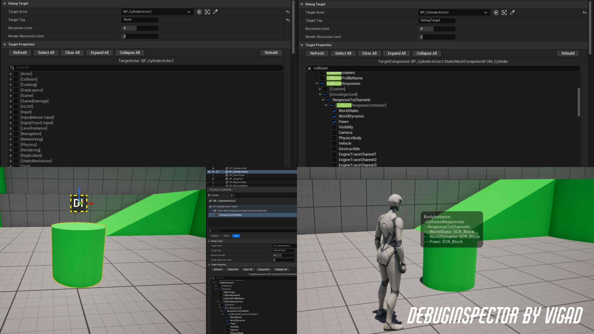
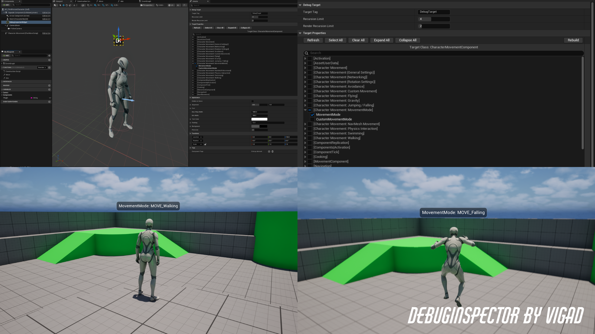
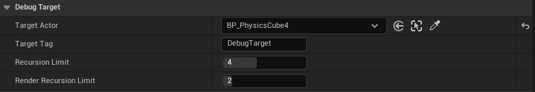
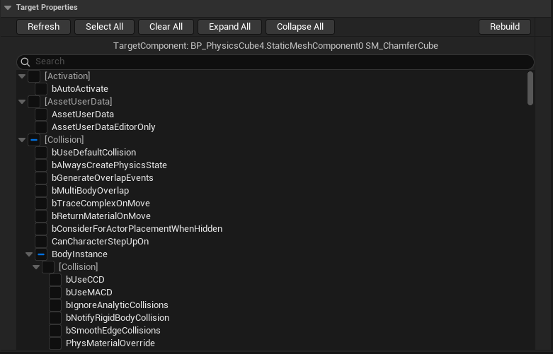
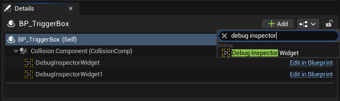
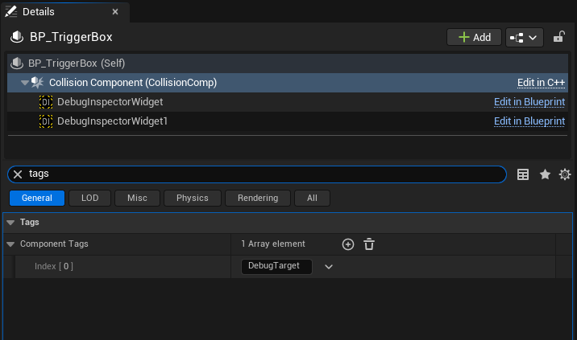
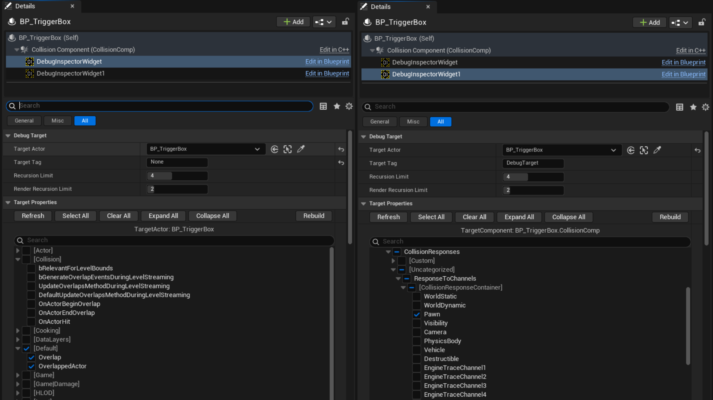
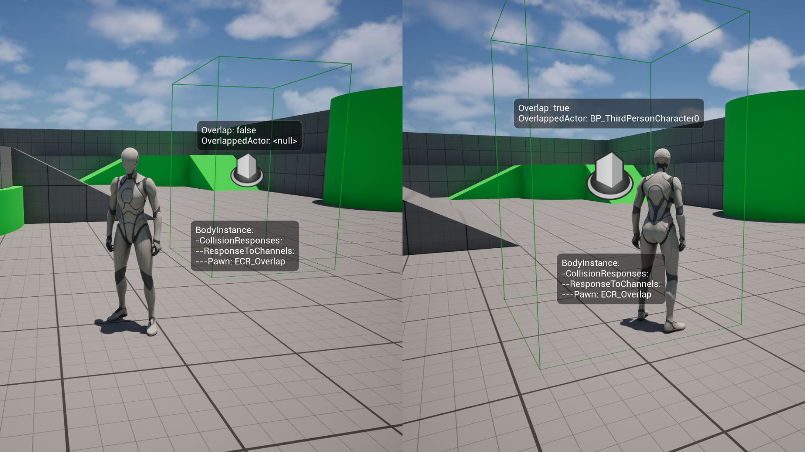

# DebugInspector Documentation



DebugInspector is a plugin for Unreal Engine 5 designed to help developers inspect `UPROPERTY` values at actor locations 
during runtime. It provides a `WidgetComponent` that will parse a tagged component or a target actor, and print selected
`UPROPERTY` values to a screen-space widget. The plugin is used from the editor and requires no C++ or Blueprint code. 
Simply add the component to an actor, select which UPROPERTY values to show and hit play.

DebugInspector officially supports UE 5.4 - 5.7 on Windows and macOS. As the plugin doesn't use any recently introduced 
or platform specific features, it's likely to work with other versions when compiled from source.

### \>> [Get DebugInspector on FAB](https://www.fab.com/listings/533af2e0-f9a2-4753-87cb-3934a2051dba) <<

### Bug Reports & Feedback
To report issues or share feedback, please see `.uplugin` for support email address.

---

## Table of Contents
- [Installation](#installation)
- [Using the plugin](#use)
- [Controls](#controls)
- [Formatting](#formatting)
- [Limitations](#limitations)
- [Creating custom strings](#custom)
- [Examples](#examples)
- [Troubleshooting](#troubleshooting)
- [Technical details](#technical)
- [Changelog](#changelog)
- [License](#license)

---

<a id="installation"></a>
## > Installation

[DebugInspector is available on FAB](https://www.fab.com/listings/533af2e0-f9a2-4753-87cb-3934a2051dba).

When installed through the Epic Games Launcher, the process is automated.

For manual installs, download the plugin for the matching engine version and place it in the top level `Plugins/` folder 
in your project (create the folder if it does not exist). After editor restart, the plugin will be visible in the Plugins
menu under the `Debug` category. You may need to enable it and restart the editor.

C++ projects can use the shipped binaries or build from source using existing project workflows. The `Plugins/DebugInspector/` 
folder should be detected automatically.

<a id="use"></a>
## > Using the plugin



DebugInspector defines a new scene component class `UDebugInspectorWidgetComponent`. This component can be 
attached to any actor in the scene. Its placement in the component hierarchy is only for rendering purposes and any 
component on any actor can be targeted regardless of where it is placed in the scene.

When placed on an actor, `UDebugInspectorWidgetComponent`  will parse the target component or actor and render a
tree view of its `UPROPERTY` variables in the details panel. The user can select properties by using the checkboxes. 
Hovering on the property row shows the variable tooltip. All properties marked with `UPROPERTY`, including inherited ones 
and those defined using C++ or Blueprints are visible, regardless of whether they are public, private or protected.

In the editor, the component is displayed as a billboard icon. The user can control component and widget behavior in the
details panel. During runtime, a screen-space widget will be rendered at the component location which displays formated 
`UPROPERTY` values on `TickComponent`.

See [example section ](#examples) for a detailed walkthrough.

When used from the Blueprint editor, the component can only target component classes in the same hierarchy or the owning
actor class. All instances of the component originating from a Blueprint hierarchy must have the same target and selection.
Instance editing of Blueprint generated components is hidden. For bespoke parsing, the component should be added to
instances instead of the whole class. The appearance of Blueprint instances can still be edited.




`UDebugInspectorWidgetComponent` is designed as a temporary component that is added to actors being investigated. It is 
meant to be used from the editor. Spawning and assigning through C++ or Blueprint code is not tested and the user does 
so at their own risk. The component should not be included in shipping builds.

<a id="controls"></a>
## > Controls

### `Debug Target`

This section is not available on instances of Blueprint generated components
(created in a Blueprint and viewed in the world)



- `Target Actor`
> The actor we are interested in parsing. This defaults to the component's owning actor. It can be set to any actor in
> the scene, including actors which can be unloaded (e.g. by the world partition system). It keeps a soft pointer to the
> actor and does not affect its lifetime. This is not available in the Blueprint editor where the component is limited
> to its own hierarchy. Updating this will rebuild the tree view.

- `Target Tag`
> The tag that marks the component that we are interested in parsing. This is case-insensitive. When this is cleared 
> (`None`), `Target Actor` itself will be parsed. In the Blueprint editor, the owning actor class will be parsed. When 
> the tag is not empty and no matching component on the target actor can be found, the failure will be reported in the 
> `Target Properties` section as well as on the widget during runtime. When more than one component has the same tag, 
> the first one found will be used. Updating this will rebuild the tree view.

- `Recursion Limit`
> The depth to which the tree view in the details panel will parse the target component or actor.  Updating this will 
> rebuild the tree view.

- `Render Recursion Limit`
> The depth that leaf nodes will be parsed in the rendered widget during runtime.
---

### `Target Properties`

This section is not available on instances of Blueprint generated components
(created in a Blueprint and viewed in the world)



This section visualizes the property hierarchy of the parsed object. The current target is listed at the top. Selecting 
or clearing any node will propagate its status to all descendants. Nodes are grouped by their category (displayed in the
tree view as `[Category]`). The categories are sorted alphabetically and properties with no category are grouped in
`Uncategorized` which is placed at the end. Whole categories can be toggled. Selections and expanded status of nodes is 
persistent across editor sessions but will be cleared when changing the target or recursion variables. The search function
will display matching names and categories together with their children. 

In the editor, the tree view updates automatically on tick and when `Debug Target` variables are changed. In the Blueprint
editor, the component does not tick and users must press the "Refresh" button when the actor blueprint is first loaded, 
after components are added or removed, and after component tags are edited. There is also a "Rebuild" button that clears
old data and regenerates the property tree.

---

### `Appearance`


- `Alignment`
> Control widget placement relative to the component location. Center is `[0.5, 0.5]`.

- `Font`
> Standard UE5 font controls. The widget can set a custom font or fall back to the default one.

- `Min Wrap Width`
> Control the length at which strings get broken up on several lines. 

- `Min Width`
> Enforce a lower limit to widget width to avoid flickering when data changes rapidly from frame to frame.

- `Padding`
> Distance between the edges of the widget and the debug text.

- `Precision`
> How many digits after the decimal point will be printed for floating point values. Internally, formatting uses `%.*f` 
> and the value is rounded. Trailing zeroes are always removed (e.g. with precision set to 3 the values `0.1234`, `20.010` 
> and `50.00` are printed as `0.123`, `20.01` and `50`).

<a id="formatting"></a>
## > Formatting

### Hierarchy

During runtime, property values are printed on a screen-space widget using formating that shows the underlying data 
structure. Entries are formatted as `Name: Value`. Hierarchical placement is displayed using either brackets (`[]` when 
inside an array, `{}` when inside a struct, `()` for common struct types) or prefixing with `-` to denote the property
depth:

```
ObjectName:
-PropertyName: Value
-StructName: {Property: Value, Property: Value}
-ArrayName: [Value, Value, Value] // <- Value may also be a struct or object
-StructName:
--Property: Value // <- Property belongs to a struct inside an object
--Property: Value

VectorName: (Value, Value, Value)
RotatorName: (P: Value, Y: Value, R: Value)
PropertyName: Value
QuatName: (X: Value, Y: Value, Z: Value, W: Value)

ObjectName: <null>
ActorName: DisplayName // <- Actor pointers are not parsed
```

Note the different struct property formats. The first one was a leaf node in the tree view and is printed on one line. 
The second was an internal node with the properties as leaf nodes themselves and is printed on multiple lines. Properties
of the same top-level categories are grouped together and an empty line is used to mark group boundaries. Internal 
categories are not grouped. NULL, uninitialized, NaN or otherwise invalid values are reported as `<null>`. Actors and 
actor components only report their names.

Complex hierarchies with arrays of structs that hold objects etc. can produce more crowded output.

<a id="limitations"></a>
## > Limitations
The widget is only rendered during runtime and not in the editor. No `UPROPERTY` values are presented in the editor.
The plugin is designed to be used from the editor and not from C++ or Blueprint code.

Parsed `UPROPERTY` variables and tagged components must exist on the target object to be able to view and select them in 
the details panel. Dynamically added components must include their own `UDebugInspectorPropertyWidget`.

The plugin does not automatically parse all UE5 data types like `TMap`, `TSet`, `TWeakObjectPtr` or `TSoftObjectPtr`. 
Functions and delegates are not turned into readable strings. The user can process unsupported types themselves and 
generate a custom `UPROPERTY` string which can then be printed using DebugInspector.

When a `UPROPERTY` on a target is of type `AActor` or `UActorComponent`, only their readable name is printed. For more
details on such objects, they should be direct debug targets.

All instances of the component originating from a Blueprint hierarchy must have the same target and selection.
For bespoke parsing, the component should be added to instances instead of the whole class. Actors can have any number of
components that are either inherited or placed on the instance directly.

<a id="custom"></a>
## > Creating custom strings

DebugInspector supports a subset of UE5 data types and has internal formatting rules. However, as the plugin reports any
selected `FString` values, users can create their own strings and expose them as a `UPROPERTY`. This may be 
public, private or protected. The widget will enforce its own formatting rules based on the hierarchy so newlines inside 
deeply nested custom strings may result in staggered output.

<a id="examples"></a>
## > Examples

As an example use case, consider debugging player character collisions with a trigger box. We would like to have
live data about the trigger volume. We must set the trigger to show in game as it's hidden by default and the widget
will not be displayed if the owning actor is hidden.

We begin by adding two `UDebugInspectorWidgerComponent` instances to the trigger actor.




We tag the `CollisionComponent` with `DebugTarget` (this can be any valid FName).



The first component will have no tag (set to None) and will therefore target the actor itself. On the trigger Blueprint we have created 
two `UPROPERTY` values: a boolean `Overlap` and an actor pointer `Overlapped Actor`. On overlap begin we set the boolean 
to true and set the pointer to the overlapped actor. On overlap end, we set the boolean to false and clear the pointer.

The second component will target the tagged `CollisionComponent` and print its collision responses to `Pawn`.

The search box allows for deeply nested properties to be selected easily.



During runtime, the component updates on tick, and we can see the debugging values printed at the specified component 
locations. Enums are printed as their readable string values, booleans use `true` / `false` and the OverlappedActor pointer
is either `<null>` or displays its readable name.



When debugging is done, the components can be removed.

<a id="troubleshooting"></a>
## > Troubleshooting

<details>
<summary> "DebugInspector is incompatible" </summary>
Plugins must list specific engine versions. As the plugin uses only core engine features, it's likely to work with future 
versions. Delete "EngineVersion" line in .uplugin to remove the warning.
</details>
<details>
<summary> "Plugin is built for a different engine version" </summary>
Plugin binaries must match the engine version where they are being used. Download the correct version binaries or
build the plugin manually from source. Automatic rebuilds often don't work.
</details>
<details>
<summary> Compilation errors </summary>
Please contact the support email with detailed error messages and information about your engine and platform.
</details>
<details>
<summary> Crashes </summary>
There is always a chance that live recompiles, Blueprint class edits and other accumulating errors may produce cached 
Reflection data that is incompatible with actual memory. A restart or recompile usually solves the problem. If not, 
please contact the support email with detailed error messages and information about your engine, platform and use case.
</details>
<details>
<summary> "Error" </summary>
Any occurrence of "Error" indicates that property descriptors, rather than the property values, are invalid. 
This can be due to cache and memory mismatches from live recompiles and Blueprint class edits. Try rebuilding the tree, 
readding the component, recompiling or restarting. In case of persistent errors, please contact the support email with 
detailed information about your engine, platform and use case.
</details>
<details>
<summary> Component shows in editor but no widget is rendered during runtime </summary>
Make sure HiddenInGame boolean flag in the Appearance section is disabled. The widget will not display if its parent
is hidden in game.
</details>
<details>
<summary> Target and property selection sections not listed </summary>
When the debug widget is placed on a Blueprint class, all instances are expected to have the same target and selected
properties. When the Blueprint changes and is recompiled, instance data may become invalid and changes are not propagated.
Editing generated instances has been hidden. For bespoke parsing of individual actors, place the debug widget on 
instances in the world, not the whole class. Actors can have both types of components.
</details>
<details>
<summary> Property selection gets reset to default Blueprint values </summary>
Happens to Blueprint generated components on their construction (move, recompile, class edit). See "...sections not listed"
above.
</details>
<details>
<summary> Flickering widgets </summary>
The widget dynamically resizes to fit its content and when this changes rapidly, it can lead to flickering. The user can
force a minimum widget width using the MinWidth property in the Appearance section.
</details>
<details>
<summary> Widget extends off-screen </summary>
The plugin is designed to display limited data. Selecting all properties will generate unnecessarily long output. The user
can reduce the set of selected properties, control the placement of the component, the alignment of the widget, the text
wrap limit or the font size to arrive at manageable output.
</details>
<details>
<summary>  "No properties selected" </summary>
There are no properties selected in the tree view and nothing for the widget to display. When changing target actor, 
component tag or recursion limit, the tree gets cleared and rebuilt to avoid stale data. The properties must be 
selected again.
</details>
<details>
<summary> "No properties found" </summary>
There are selected nodes but no data. The plugin cannot display editor-only properties during runtime as they don't 
exist. The tree view may enable selecting editor-only properties that get culled for runtime.
</details>
<details>
<summary> "Unsupported type" </summary>
The plugin does not support parsing all UE5 types like TMap, TSet, TWeakObjectPtr or TSoftObjectPtr. The user can create
their own debug string and expose it as a custom UPROPERTY.
</details>
<details>
<summary> "null" </summary>
Object or struct has a non-truthy value (e.g. uninitialized data, nullptr).
</details>
<details>
<summary> "None" </summary>
The value for an empty FName
</details>
<details>
<summary> "max depth" </summary>
Displayed in the tree view after the property name. The parsing of this property has reached the maximum recursion limit.
The property is still selectable and will be parsed during runtime.
</details>

<a id="technical"></a>
## > Technical details

`UDebugInspectorWidgetComponent` inherits from `UWidgetComponent` and works using UE5's Reflection system. The property
tree is rebuilt when the target changes. To reduce traversal time, a pruned tree containing only selected properties is 
created on `BeginPlay`. During runtime, the pruned tree is traversed each tick and leaf nodes are processed to create 
debug strings. There is some overhead from tree building and traversal as well as widget rendering but the plugin should
not introduce a noticeable cost. Although not computationally expensive for debugging during development, the component 
should not be included in shipping builds.

<a id="changelog"></a>
## > Changelog

- 1.0 - Initial release

<a id="license"></a>
## > License

Copyright (c) 2026, Vigad. All rights reserved.