# DebugInspector Documentation

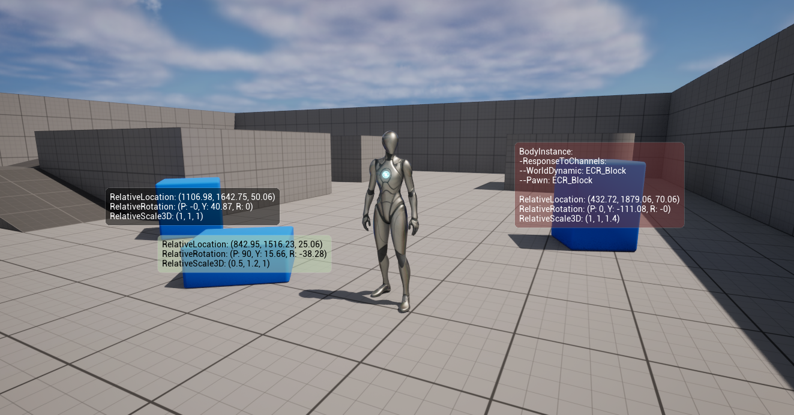

DebugInspector is a plugin for Unreal Engine 5 designed to help developers inspect `UPROPERTY` values at actor locations 
during runtime. It provides a `WidgetComponent` that will parse a tagged component on a target actor and print selected
`UPROPERTY` values to a screen-space widget. The plugin is used from the editor and requires no C++ or Blueprint code.

DebugInspector officially supports UE 5.0 - 5.7 on Windows, macOS and Linux.

### \>> [Get DebugInspector on FAB](https://www.fab.com) <<

### Bug Reports & Feedback
To report issues or share feedback, please see FAB listing or `.uplugin` for support email address.

---

## Table of Contents
- [Installation](#installation)
- [Using the plugin](#use)
- [Controls](#controls)
- [Formatting](#formatting)
- [Limitations](#limitations)
- [Creating custom strings](#custom)
- [Examples](#examples)
- [Troubleshooting](#troubleshooting)
- [Technical details](#technical)
- [Changelog](#changelog)
- [License](#license)

---

<a id="installation"></a>
## > Installation

[DebugInspector is available on FAB](https://www.fab.com).

Download the plugin for the matching engine version and place it in the top level `Plugins/` folder (create the folder
if it does not exist). After editor restart, the plugin will be visible in the Plugins menu under the `Debug` category.

For C++ projects, the plugin can either use the shipped binaries or be manually built from source using existing project
workflows. The `Plugins/DebugInspector/` folder should be automatically detected.

<a id="use"></a>
## > Using the plugin

DebugInspector defines a new actor scene component class called `UDebugInspectorWidgetComponent`. This component can be 
attached to any actor in the scene. Its placement in the actor hierarchy is only for rendering purposes and the component
can target any component on any actor regardless of where it is placed in the scene.

When placed in the world, the component will parse the target component or actor and render a tree view of its `UPROPERTY` 
variables in the details panel. Both public and private properties are parsed. The user can select properties by using 
the checkboxes. Hovering on the property row shows the variables tooltip. All properties, including inherited ones and 
those defined using C++ or Blueprints are visible, regardless of whether they are public, private or protected.

In the editor, the component is displayed as a billboard icon. During runtime, a screen-space widget will be rendered at
the location. The widget will move with its parent and output is generated on `TickComponent`.

The user can control the component and widget behavior in the details panel.

<a id="controls"></a>
## > Controls

### `Debug Target`

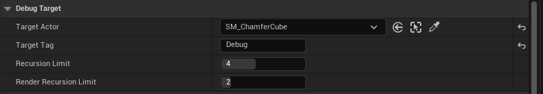


- `Target Actor`
> The actor we are interested in parsing. This defaults to the component's owning actor. It can be set to any actor in
> the scene, including actors which can be unloaded (e.g. by the world partition system). It keeps a soft pointer to the
> actor and does not affect its lifetime.

- `Target Tag`
> The tag that marks the component that we are interested in parsing. This is case-insensitive. When this is cleared 
> (`None`), `Target Actor` itself will be parsed. When the tag is not empty and no matching component on the target 
> actor can be found, the failure will be reported in the `Debug Properties` section as well as on the widget during 
> runtime. When more than one component has the same tag, the first one found will be used. Tags have no effect when 
> parsing target actors.

- `Recursion Limit`
> The depth to which the tree view in the details panel will parse the target component or actor.

- `Render Recursion Limit`
> The depth that leaf nodes will be parsed in the rendered widget during runtime.
---

### `Target Properties`

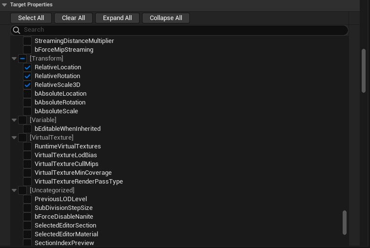

This section visualizes the property hierarchy of the parsed object. Selecting or clearing any node will propagate its 
status to all descendants. Nodes are grouped by their category and displayed in the tree view as `[Category]`. The 
categories are sorted alphabetically and properties with no category are grouped in `Uncategorized` which is placed at 
the end. Whole categories can be toggled. Selections and expanded status of nodes is persistent across editor sessions
but will be cleared when changing the target or recursion variables. The search function will display matching names and
categories together with their children.

---

### `Appearance`


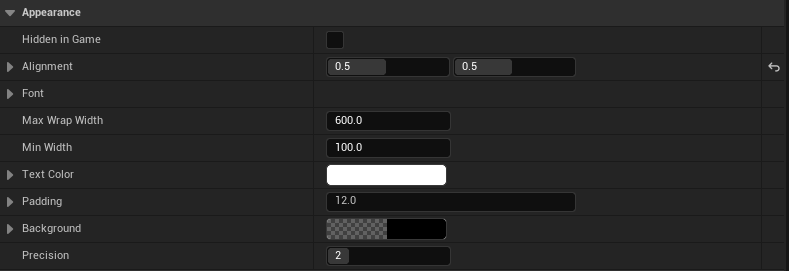

- `Alignment`
> Control widget placement relative to the component location. Center is `[0.5, 0.5]`.

- `Font`
> Standard UE5 font controls. The widget can set a custom font or fall back to the default one.

- `Min Wrap Width`
> Limit text wrap. Text will only break on whitespace.

- `Min Width`
> Limit the widget width to avoid flickering when data changes rapidly from frame to frame.

- `Padding`
> Distance between the edges of the widget and the debug text.

- `Precision`
> How many digits after the decimal point will be printed for floating point values. Internally, formatting uses `%.*f` 
> and the value is rounded. Trailing zeroes are always removed (e.g. with precision set to 3 the values `0.1234`, `20.010` 
> and `50.00` are printed as `0.123`, `20.01` and `50`).

<a id="formatting"></a>
## > Formatting

### Hierarchy
All properties are formatted as `Name: Value`. Hierarchical placement is displayed using either brackets (`[]` when 
inside an array, `{}` when inside a struct, `()` for select struct types) or prefixing with `-` to denote the property
depth:

```
ObjectName:
-PropertyName: Value
-StructName: {Property: Value, Property: Value}
-ArrayName: [Value, Value, Value] // <- Value may also be a struct or object
-StructName:
--Property: Value // <- Property belongs to a struct inside an object
--Property: Value

VectorName: (X: Value, Y: Value, Z: Value)
PropertyName: Value
QuatName: (X: Value, Y: Value, Z: Value, W: Value)

ObjectName: <null>
ActorName: DisplayName // <- Actor pointers are not parsed
```

Note the different struct property formats. The first one was a leaf node in the tree view and is printed on one line. 
The second was an internal node with the properties as leaf nodes themselves and is printed on multiple lines. Properties
of the same top-level categories are grouped together and an empty line is used to mark group boundaries. Internal 
categories are not grouped. NULL, uninitialized, NaN or otherwise invalid values are reported as `<null>`. Actors and 
actor components only report their names.

Complex hierarchies with arrays of structs that hold objects etc. can produce more crowded output.

<a id="limitations"></a>
## > Limitations

The widget is only rendered during runtime and not in the editor. The parsed actor and component must exist in the
editor and objects spawned during gameplay cannot be targeted. The plugin does not currently support adding the component
to Blueprint classes (adding to BP instances is supported).

The plugin does not parse all UE5 data types like `TMap`, `TSet`, `TWeakObjectPtr` or `TSoftObjectPtr`. Functions and 
delegates are also not turned into readable strings. The user can process unsupported types themselves and generate a 
custom `UPROPERTY` string which can then be printed using the DebugInspector widget.

When a `UPROPERTY` on a target is of type `AActor` or `UActorComponent`, only their readable name is printed. For more
details on such objects, they should be direct debug targets.

<a id="custom"></a>
## > Creating custom strings

DebugInspector supports a subset of UE5 data types and has internal formatting rules. However, as the plugin reports any
selected `FString` or `FText` values, users can create their own strings and expose them as a `UPROPERTY`. This may be 
public, private or protected. The widget will enforce its own formatting rules based on the hierarchy so newlines inside 
deeply nested custom strings may result in staggered output.

<a id="examples"></a>
## > Examples

We want to debug the collisions of a trigger box. We add two `UDebugInspectorWidgerComponent` instances to the actor.

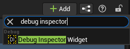

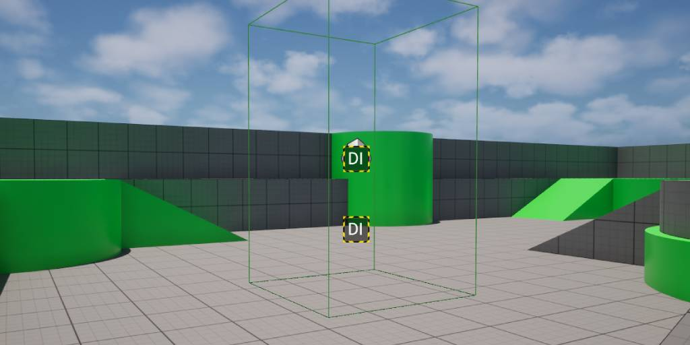

We tag the `CollisionComponent` with `DebugTarget`.

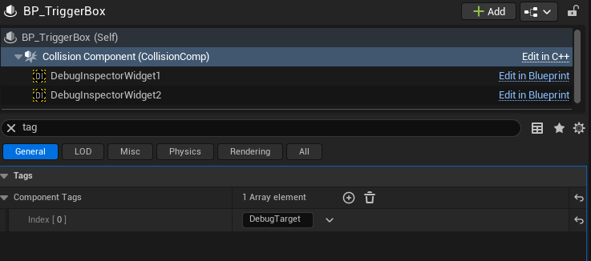

The first component will target the `CollisionComponent` and print its collision responses to `WorldStatic`, 
`WorldDynamic` and `Pawn`.

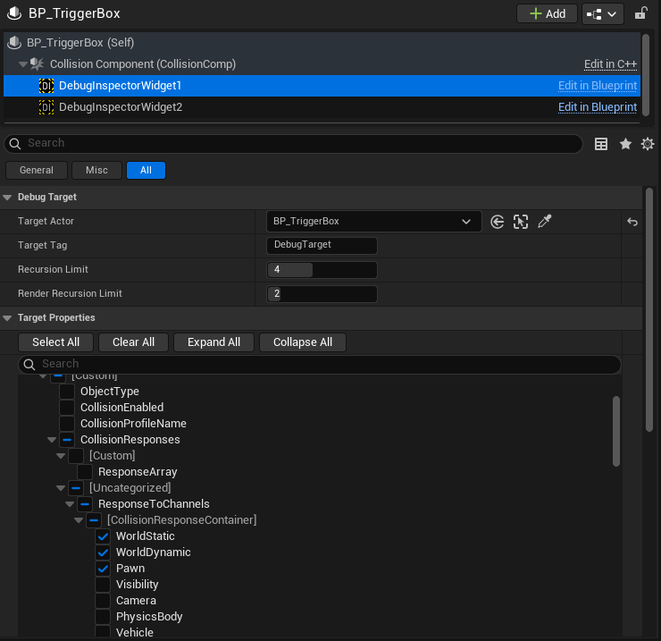

The second component will have no tag and will therefore target the actor itself. On the actor Blueprint we have created 
two `UPROPERTY` values: a boolean `Overlap` and an actor pointer `Overlapped Actor`. On overlap begin we set the boolean 
to true and set the pointer to the overlapped actor. On overlap end, we set the booelan to false and clear the pointer.

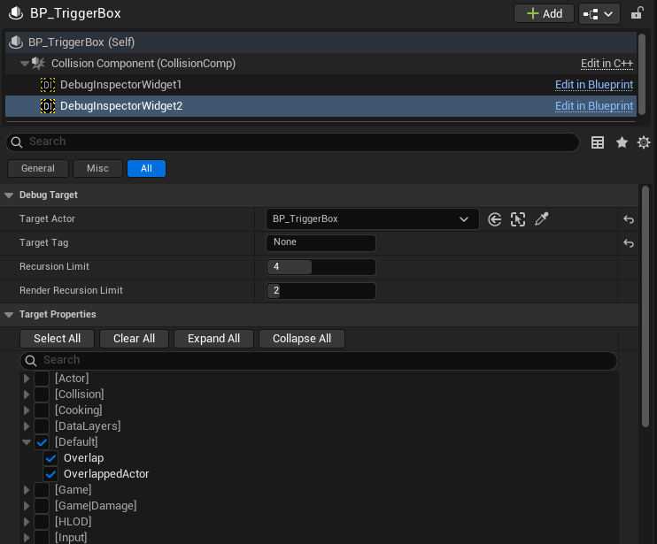

During runtime, the component updates on tick, and we can see the debugging values printed at the specified component 
locations.

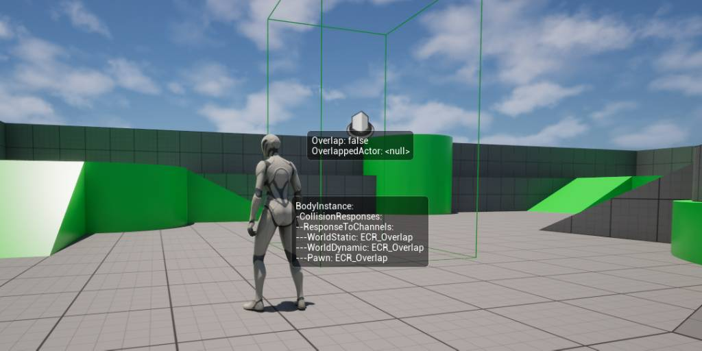
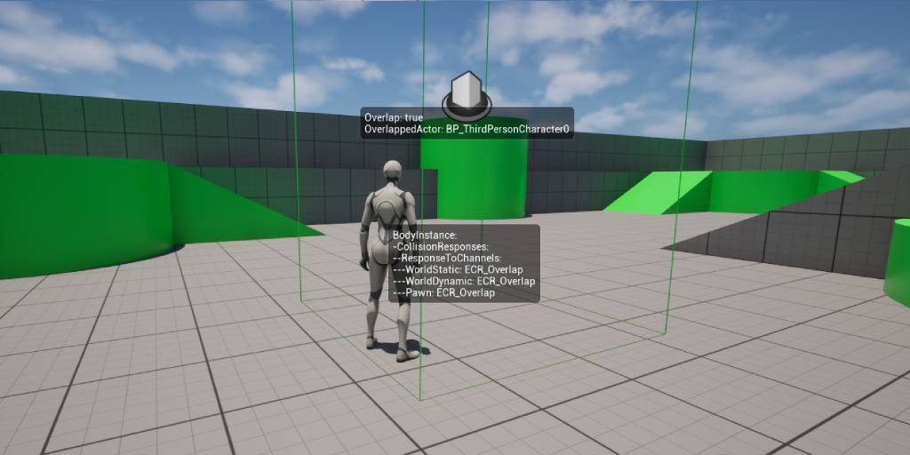

<a id="troubleshooting"></a>
## > Troubleshooting

<details>
<summary> "Plugin is built for a different engine version" </summary>
Plugin binaries must match the engine version where they are being used. Either download the correct version binaries or
build the plugin manually from source.
</details>
<details>
<summary> Compilation errors </summary>
Please contact the support email with detailed error messages and information about your engine and platform.
</details>
<details>
<summary> Flickering widgets </summary>
The widget dynamically resizes to fit its content and when this changes rapidly, it can lead to flickering. The user can
force a minimum widget width using the Min Width property in the Appearance tab.
</details>
<details>
<summary> Widget extends off-screen </summary>
The plugin is meant to display limited data. Selecting all properties will generate unnecessarily long output. The user
can reduce the set of selected properties, control the placement of the component, the alignment of the widget, the text
wrap limit or the font size to arrive at manageable output.
</details>
<details>
<summary>  "No properties selected" </summary>
There are no properties selected in the tree view and nothing for the widget to display. When switching target actors, 
component tags or recursion limits, the tree gets cleared and rebuilt to avoid stale data. The properties must be 
selected again.
</details>
<details>
<summary> "No properties found" </summary>
The plugin cannot display editor-only properties during runtime as they don't exist. The tree view may show editor-only 
properties that get culled for runtime. Unfortunately, there isn't a robust way to detect properties inside #if WITH_EDITOR 
blocks.
</details>
<details>
<summary> "Unsupported type" </summary>
The plugin does not support parsing all UE5 types like TMaps, TSets, TWeakObjectPtr or TSoftObjectPtr. The user can create
their own debug string and expose it as a custom UPROPERTY in these cases.
</details>
<details>
<summary> "null" </summary>
Target object or struct is NULL. For example, uninitialized data or unassigned values. When the data can be shown to be
not-null during runtime, it may be possible that the underlying parsing is breaking on a memory pointer in which case 
please report this as a bug.
</details>
<details>
<summary> "None" </summary>
The value for an empty FName
</details>
<details>
<summary> "max depth" </summary>
The parsing of this property has reached the maximum recursion limit. Displayed in the tree view after the property name. 
The property is still selectable and will be parsed during runtime.
</details>

<a id="technical"></a>
## > Technical details

`UDebugInspectorWidgetComponent` inherits from `UWidgetComponent` and works using UE5's reflection system. It ticks in
the editor to find tagged components on target actors. The property tree is rebuilt when the target changes. To reduce 
traversal time, a pruned tree containing only selected properties is created on `BeginPlay`. During runtime, the pruned
tree is traversed each tick and leaf nodes are processed to create debug strings. Although not computationally expensive 
debugging during development, the component should not be included shipping builds.

<a id="changelog"></a>
## > Changelog

- 1.0 - Initial release

<a id="license"></a>
## > License

Copyright (c) 2026, Vigad. All rights reserved.